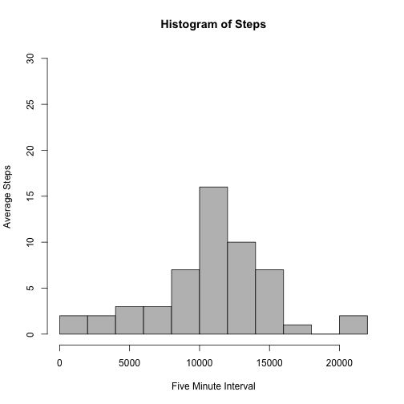
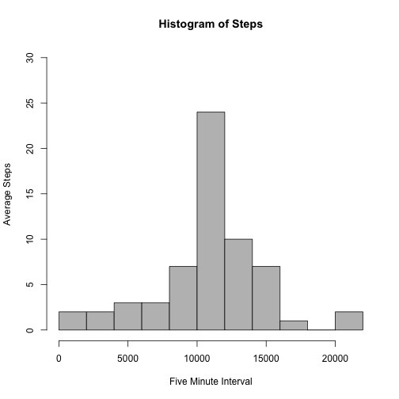
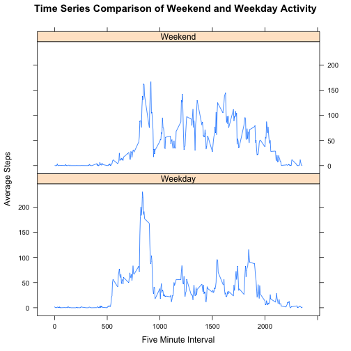

Loading and preprocessing the data
----------------------------------

Load required libraries.


```r
library(plyr)
library(lattice)
library(knitr)
```

Read data from csv file named activity.csv from the zipped file repdata-data-activity.zip.

```r
data = read.csv('activity.csv')
```

Quick look at the file. Interval is the five minute time interval.

```r
head(data)
```

```
##   steps       date interval
## 1    NA 2012-10-01        0
## 2    NA 2012-10-01        5
## 3    NA 2012-10-01       10
## 4    NA 2012-10-01       15
## 5    NA 2012-10-01       20
## 6    NA 2012-10-01       25
```

What is mean total number of steps taken per day?
----------------------------------

To determine the mean steps, the data is summarised by date.

```r
activity <- ddply(data, .(date), summarise, steps = sum(steps))
```

Plot a histogram to visually look at the distribution.

```r
hist(activity$steps, breaks = 10,
     col="grey",
     xlab="Five Minute Interval", 
     ylab="Average Steps",
     main="Histogram of Steps",
     ylim = c(0, 30))
```

 

NAs are in the dataset.
Calculate the daily mean and median by excluding the NAs.

```r
mean(activity$steps, na.rm = TRUE)
```

```
## [1] 10766.19
```

```r
median(activity$steps, na.rm = TRUE)
```

```
## [1] 10765
```

The mean is 10766.19.
The median is 10765.

What is the average daily activity pattern?
----------------------------------

Plot the five minute interval for average number of steps to see an average daily activity pattern.

```r
interval <- ddply(data, .(interval), summarise, steps = mean(steps, na.rm = TRUE))
names(interval) = c("interval", "mean_steps")
plot(interval, type = 'l',
     xlab="Five Minute Interval", 
     ylab="Average Steps",
     main="Pattern of Daily Activity by Five Minute Interval")
```

 

Determine the five minute interval with maximum number of steps.

```r
interval[which.max(interval$mean_steps==max(interval$mean_steps)),]
```

```
##     interval mean_steps
## 104      835   206.1698
```

The interval with the maximum steps is 835.

Imputing missing values
----------------------------------

Calculate number of missing values (NAs).

```r
sum(is.na(data$steps))
```

```
## [1] 2304
```

The number of missing values is 2304.

We can fill in missing data in several ways, for example:
1. Drop the rows with NAs and then average the data.
2. Calculate a daily mean and apply the mean to missing daily values.
3. Calculate an interval mean (five minute) and then apply that to any interval with NAs.

Let's do #3 and impute the missing values with the mean of each five minute interval and create new dataset. This should allow a better look at the activity patterns throughout the day.

```r
missing <- merge(data, interval, by = "interval", sort = FALSE)
missing <- missing[with(missing, order(date, interval)),]
missing$steps[is.na(missing$steps)] <- missing$mean_steps[is.na(missing$steps)]
missing$mean_steps = NULL
```

Quick look at new dataset to see new data has replaced NAs.

```r
head(missing)
```

```
##     interval     steps       date
## 1          0 1.7169811 2012-10-01
## 63         5 0.3396226 2012-10-01
## 128       10 0.1320755 2012-10-01
## 205       15 0.1509434 2012-10-01
## 264       20 0.0754717 2012-10-01
## 327       25 2.0943396 2012-10-01
```

Make histogram of steps with new dataset.

```r
missing_agg <- ddply(missing, .(date), summarise, steps = sum(steps))
hist(missing_agg$steps, breaks = 10,
     col="grey",
     xlab="Five Minute Interval", 
     ylab="Average Steps",
     main="Histogram of Steps",
     ylim = c(0, 30))
```

 

Due to imputing a mean value into the intervals, the histogram has a higher middle bin than the original histogram.

Calculate the daily mean and median.

```r
mean(missing_agg$steps)
```

```
## [1] 10766.19
```

```r
median(missing_agg$steps)
```

```
## [1] 10766.19
```

The mean is 10766.19 and the median is 10766.19.
Means are the same as before, however the median is slightly different from the original dataset.

Are there differences in activity patterns between weekdays and weekends?
----------------------------------

Create new variables "weekday" and "weekend" indicating day of week.

```r
missing$wday <- weekdays(as.Date(missing$date))
missing$type <- ifelse(as.POSIXlt(missing$date)$wday %in% c(0, 6), "Weekend", "Weekday")
missing_diff <- aggregate(steps ~ interval + type, data=missing, mean)
head(missing_diff)
```

```
##   interval    type      steps
## 1        0 Weekday 2.25115304
## 2        5 Weekday 0.44528302
## 3       10 Weekday 0.17316562
## 4       15 Weekday 0.19790356
## 5       20 Weekday 0.09895178
## 6       25 Weekday 1.59035639
```

Plot panel of time series of the five minute intervals showing the pattern of weekdays vs. weekends.

```r
xyplot(missing_diff$steps ~ missing_diff$interval | missing_diff$type,
       layout = c(1, 2),
       type = "l",
       xlab = "Five Minute Interval",
       ylab = "Average Steps",
       main = "Time Series Comparison of Weekend and Weekday Activity")
```

 

There are differences. Weekdays have higher activity in the morning, while weekends seem to have higher average afternoon step counts.

